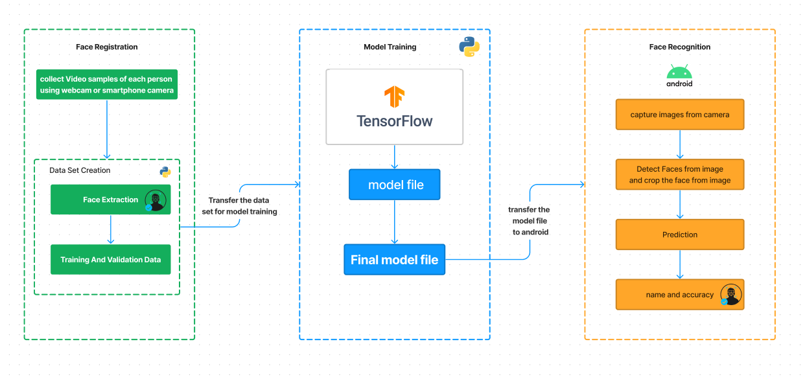

# Face Recognition Android with Tensorflow (tflite)

A FaceRecognition  Android application designed for real-time face recognition using TensorFlow Lite models. Unlike traditional face recognition systems that rely on cloud-based processing, this app runs predictions locally on the device. 

## Features

- On-Device Processing: Utilizes TensorFlow Lite to perform face recognition predictions directly on the Android device, eliminating the need for constant internet connectivity and preserving user privacy.

- Real-time Recognition: Achieves fast and accurate face recognition in real-time, enabling users to seamlessly unlock their devices, access secure areas, or personalize user experiences.

## - Built With 🛠
- [CameraX](https://developer.android.com/jetpack/androidx/releases/camera) - that makes it easier to add camera capabilities to your app.
- [MLKIT](https://developers.google.com/ml-kit/vision/face-detection/android) - You can use ML Kit to detect faces in images and video.

- [Tensor Flow](https://www.tensorflow.org/lite) -  Face Recognition

